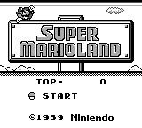
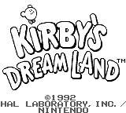

<a name="readme-top"></a>

<!-- PROJECT LOGO -->
<br />
<div align="center">
  <a href="https://github.com/iPanja/gameboy-rust">
    
  </a>

  <h3 align="center">Game Boy Emulator (+ Debugger)</h3>

  <p align="center">
    A work-in-progress Game Boy (DMG) emulator and debugger
    <br />
    <a href="https://github.com/iPanja/gameboy-rust"><strong>Explore the docs »</strong></a>
    <br />
    <br />
    <a href="#demos">View Demo</a>
    ·
    <a href="https://github.com/iPanja/gameboy-rust/issues/new?labels=bug&template=bug-report---.md">Report Bug</a>
    ·
    <a href="https://github.com/iPanja/gameboy-rust/issues/new?labels=enhancement&template=feature-request---.md">Request Feature</a>
  </p>
</div>

<!-- TABLE OF CONTENTS -->
<details>
  <summary>Table of Contents</summary>
  <ol>
    <li>
      <a href="#about-the-project">About The Project</a>
      <ul>
        <li><a href="#features">Features</a></li>
        <li><a href="#tests-passed">Tests Passed</a></li>
        <li><a href="#demos">Demos</a></li>
      </ul>
    </li>
    <li>
      <a href="#getting-started">Getting Started</a>
      <ul>
        <li><a href="#keymapping">Keymapping</a></li>
        <li><a href="#prerequisites">Prerequisites</a></li>
        <li><a href="#installation">Installation</a></li>
      </ul>
    </li>
    <li><a href="#usage">Usage</a></li>
    <li><a href="#roadmap">Roadmap</a></li>
    <li><a href="#license">License</a></li>
    <li><a href="#acknowledgments">Acknowledgments</a></li>
  </ol>
</details>

<!-- ABOUT THE PROJECT -->

## About The Project

This is a work-in-progress Game Boy (specifically [DMG-01](https://en.wikipedia.org/wiki/Game_Boy)) emulator and debugger.

### Features

- CPU
- PPU (Pixel Processing Unit)
  - Scanline rendering
- MBC (Memory Bank Controllers)
  - MBC0
  - MBC1
- Joypad Input
- Timer
- Interrupts

### Tests Passed

- Blargg's CPU instructions
- Acid2

### Demos

Screen capture of main display:




frontend-imgui:

[![Game Boy Emulator & Debugger][product-screenshot]](https://github.com/iPanja/gameboy-rust)

<p align="right">(<a href="#readme-top">back to top</a>)</p>

<!-- GETTING STARTED -->

## Getting Started

All you should need to run/debug this locally is [Rust](https://www.rust-lang.org/tools/install). All other dependencies will automatically be installed via Rust's package manager (Cargo) when you attempt to run the project.

```
git clone https://github.com/iPanja/gameboy-rust
# Download a Game Boy ROM online and follow the directions under prerequisites to load it via code
cd gameboy-rust/frontend-imgui
cargo run
```

### Keymapping

Custom keybinds/keymapping is not yet implemented. Currently, this is the setup:

| Keyboard Input | Corresponding Joypad Input |
| -------------- | -------------------------- |
| W              | Up                         |
| A              | Left                       |
| S              | Down                       |
| D              | Right                      |
| Right Arrow    | A                          |
| Left Arrow     | B                          |
| Q              | Start                      |
| E              | Select                     |

### Prerequisites

1. Install Rust: https://www.rust-lang.org/tools/install.
2. Download some Game Boy ROMs to play with!

I recommend creating a `/rom` directory in the root of the project. Regardless, modify the following line (~47) in `frontend-imgui/src/main.rs` to read in the ROM you supplied.

**line ~47:** `let mut rom = std::fs::File::open("../roms/<YOUR ROM></ROM>.gb").expect("INVALID ROM");`

3. Optionally: Download the Game Boy boot ROM: http://www.neviksti.com/DMG/DMG_ROM.bin. Enable it in your choice of frontend.

<p align="right">(<a href="#readme-top">back to top</a>)</p>

<!-- USAGE EXAMPLES -->

## Usage

There are three separate packages in this repository.

- emulator
- frontend-egui
- frontend-imgui

### Emulator

This houses the core of the Game Boy emulator. Currently, it has all most all of the features you might expect, _except_ sound.

### User Interfaces

- **(Recommended)** `frontend-imgui`: Debugger and non-scaling display using a dear-imgui binding, [imgui-rs](https://github.com/imgui-rs/imgui-rs).
- _(Buggy)_ `frontend-egui`: Minimalistic, scaling display using the rust crate [egui](https://github.com/emilk/egui).

Currently there are two separate frontends/user interfaces that actually allow you to run/play the emulator. Simply run `cargo run` in either directory to start!

This project is still a work in progress especially the user interfaces. They require a lot more polishing and some of these plans are listed in the <a href="#roadmap">roadmap</a></li>.

<p align="right">(<a href="#readme-top">back to top</a>)</p>

<!-- ROADMAP -->

## Roadmap

- Emulator
  - [ ] Implement a save manager
  - [ ] Fix timer, currently runs too fast (see Super Mario Land)
  - [ ] Implement the MBC(s) needed to play the Pokemon games
  - [ ] Speed changing
  - [ ] Pixel FIFO
- User Interface
  - [ ] Custom key mapping
  - [ ] Loading ROMS
  - [ ] Scaling display in frontend-imgui
  - [ ] Fix frontend-egui on windows machines
  - [ ] Speed changing

See the [open issues](https://github.com/iPanja/gameboy-rust/issues) for a full list of proposed features (and known issues).

<p align="right">(<a href="#readme-top">back to top</a>)</p>

<!-- LICENSE -->

## License

Distributed under the MIT License. See `LICENSE` for more information.

<p align="right">(<a href="#readme-top">back to top</a>)</p>

<!-- ACKNOWLEDGMENTS -->

## Acknowledgments

Development

- [GBDocs Opcode Table](https://gbdev.io/gb-opcodes/optables/)
- [Game Boy CPU Manual](http://marc.rawer.de/Gameboy/Docs/GBCPUman.pdf)
- [Pan Docs](https://gbdev.io/pandocs/)
- [GBEDG (PPU, MBC)](https://hacktix.github.io/GBEDG/)

Project Sources

- [README Template](https://github.com/othneildrew/Best-README-Template)
- [Gameboy Project Icon - Stockio](https://www.flaticon.com/free-icons/gameboy)

<p align="right">(<a href="#readme-top">back to top</a>)</p>

<!-- MARKDOWN LINKS & IMAGES -->
<!-- https://www.markdownguide.org/basic-syntax/#reference-style-links -->

[issues-shield]: https://img.shields.io/github/issues/othneildrew/Best-README-Template.svg?style=for-the-badge
[issues-url]: https://github.com/iPanja/gameboy-rust/issues
[license-shield]: https://img.shields.io/github/license/othneildrew/Best-README-Template.svg?style=for-the-badge
[license-url]: https://github.com/iPanja/gameboy-rust/blob/master/LICENSE.txt
[linkedin-shield]: https://img.shields.io/badge/-LinkedIn-black.svg?style=for-the-badge&logo=linkedin&colorB=555
[linkedin-url]: https://linkedin.com/in/othneildrew
[product-screenshot]: readme_media/Screenshot.png
[Rust-badge]: https://img.shields.io/badge/Rust-000000?style=for-the-badge&logo=rust&logoColor=white
[Rust-url]: https://www.rust-lang.org/
